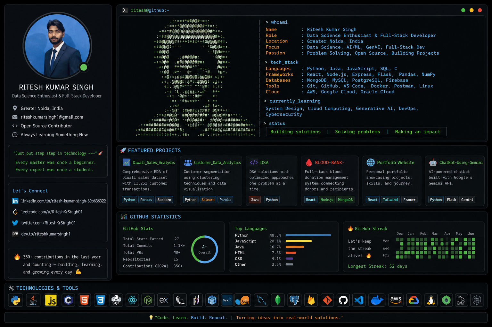

# 👋 Hi, I'm Ritesh Kumar Singh

<p align="center">
  
</p>

<p align="center">
  <b>Data Science Enthusiast • AI/ML Explorer • Full-Stack Developer • Problem Solver</b>
</p>

<p align="center">
  <i>"Just put step step in technology ~~~ 🚀"</i><br>
  <i>"Every master was once a beginner. Every expert was once a student."</i>
</p>

---

## 🖥️ `whoami`

<table>
<tr>
<td width="45%" align="center">


</td>

<td width="55%">

```text
> whoami

Name       : Ritesh Kumar Singh
Location   : Greater Noida, India
Role       : Data Science Enthusiast
             Full-Stack Developer
Focus      : Data Science • AI/ML • GenAI
             Full-Stack Development
Passion    : Problem Solving • Building Projects
             Open Source • Continuous Learning

> current_focus

[+] Data Structures & Algorithms
[+] Data Analytics
[+] Generative AI
[+] RAG Applications
[+] System Design
[+] Cloud Computing

> status

Building solutions.
Solving problems.
Learning every day.
```

</td>
</tr>
</table>

---

## 🙋‍♂️ About Me

* 🎓 B.Tech student specializing in **Data Science**
* 📍 Based in **Greater Noida, India**
* 💻 Passionate about **Data Science, DSA, Data Engineering & Full-Stack Development**
* 🧠 Currently exploring **Generative AI, RAG, System Design & Cloud Computing**
* 🩸 Building **BLOOD-BANK-** — an initiative towards humanity
* 🧩 Regularly solving problems on **LeetCode**
* 🔍 Interested in **Data Analytics, Web Scraping & Cybersecurity**
* 🚀 Building practical projects instead of only learning theory
* 💬 Ask me about **Python, Java, SQL, Data Analysis & Web Development**
* ⚡ Believer in: **Code → Learn → Build → Repeat**

---

# 🛠️ Tech Stack

### 👨‍💻 Languages

<p>


</p>

### 📊 Data Science & Analytics

<p>


</p>

### ⚛️ Frameworks & Backend

<p>


</p>

### 🗄️ Databases

<p>


</p>

### 🤖 AI / Generative AI

<p>


</p>

### ☁️ Cloud & Tools

<p>


</p>

---

# 🚀 Featured Projects

<table>
<tr>
<td width="50%">

### 📊 Diwali Sales Analysis

EDA of **11,251 customer transactions** with insights into customer behavior and sales trends.

**Python • Pandas • Seaborn • Matplotlib**

</td>

<td width="50%">

### 📈 Customer Data Analytics

Customer segmentation and behavioral analysis using clustering and visualization.

**Python • Scikit-learn • Pandas • Matplotlib**

</td>
</tr>

<tr>
<td>

### 🧩 DSA

My collection of DSA solutions with optimized approaches and problem-solving patterns.

**Java • Python**

</td>

<td>

### 🩸 BLOOD-BANK-

Full-stack blood donation management system connecting donors and recipients.

**React • Node.js • Express • MongoDB**

</td>
</tr>

<tr>
<td>

### 🌐 Portfolio Website

Personal portfolio showcasing my projects, skills and development journey.

**React • Tailwind CSS • Framer Motion**

</td>

<td>

### 🤖 ChatBot Using Gemini

AI-powered chatbot built using Google's Gemini API.

**Python • Flask • Gemini API • HTML/CSS**

</td>
</tr>
</table>

---

# 📊 GitHub Statistics

<p align="center">


</p>

<p align="center">

</p>

---

# 🧠 Currently Learning

```text
┌───────────────────────────────────────────────────────────┐
│                   CURRENTLY LEARNING                      │
├───────────────────────────────────────────────────────────┤
│                                                           │
│  🧠 Generative AI       ████████████████░░░░              │
│  🔗 RAG Systems         ██████████████░░░░░░              │
│  🏗️ System Design       ████████████░░░░░░░░              │
│  ☁️ Cloud Computing     ███████████░░░░░░░░░              │
│  🔐 Cybersecurity       █████████░░░░░░░░░░░              │
│  📊 Advanced Analytics  ███████████████░░░░░              │
│                                                           │
└───────────────────────────────────────────────────────────┘
```

---

# 🎯 2026 Goals

* [ ] Build production-ready GenAI applications
* [ ] Master DSA & problem-solving
* [ ] Build advanced RAG applications
* [ ] Improve system-design knowledge
* [ ] Contribute more to Open Source
* [ ] Deploy more projects to the cloud
* [ ] Keep improving Data Science & AI skills

---

# 🌐 Connect With Me

<p align="center">

<a href="https://linkedin.com/in/ritesh-kumar-singh-69b636322">

</a>

<a href="https://leetcode.com/u/RiteshKrSingh01">

</a>

<a href="https://twitter.com/RiteshKrSingh01">

</a>

<a href="https://dev.to/riteshkumarsingh1">

</a>

</p>

---

<p align="center">

### 💻 Code. Learn. Build. Repeat.

🔥 **350+ contributions in the last year and counting**

*Building, learning, solving problems, and growing every day.* 🚀

</p>

